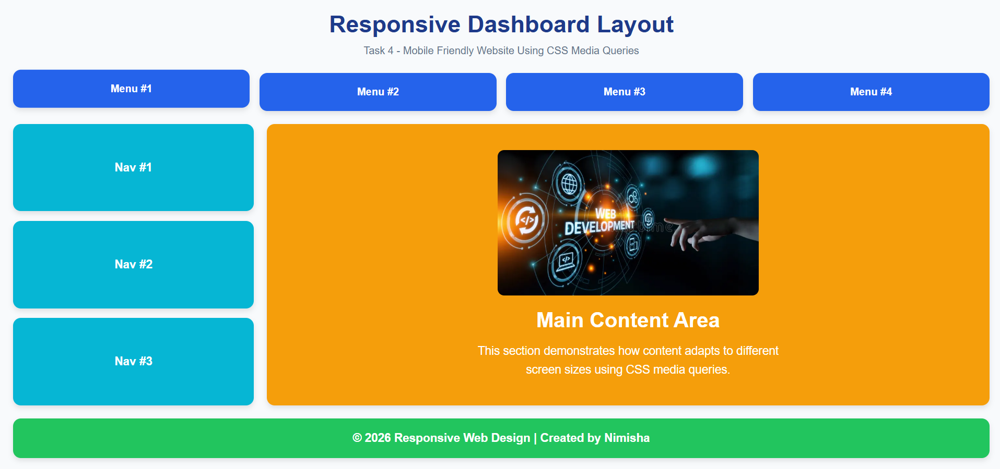
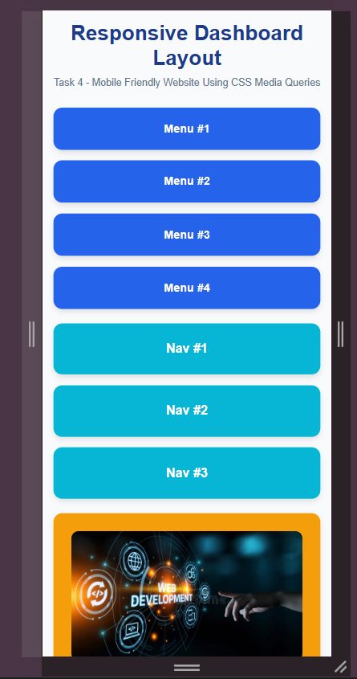
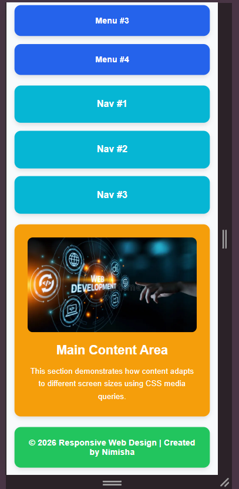

# 📱 Web Development Internship - Task 4

## 📌 Project Title

**Responsive Dashboard Layout Using CSS Media Queries**

---

## 🎯 Objective

Convert a desktop-only webpage into a mobile-friendly responsive website using CSS Media Queries. The layout adapts automatically to different screen sizes by stacking elements vertically and adjusting spacing, font sizes, and content arrangement for mobile devices.

---

## 🛠️ Technologies Used

* HTML5
* CSS3
* Flexbox
* CSS Media Queries
* Chrome DevTools

---

## ✨ Features

* Responsive dashboard-style layout
* Four menu sections in the header
* Navigation sidebar
* Main content area with image
* Responsive image scaling
* Mobile-friendly design
* Flexbox-based layout
* CSS Media Queries for responsiveness
* Desktop and mobile viewport support

---

## 📁 Project Structure

```text
Task4/
├── desktop_view.png
├── image.png
├── index.html
├── mobile_view_0.png
├── mobile_view_1.png
├── README.md
└── style.css
```

---

## 📋 Layout Structure

### Desktop View

```text
Menu #1 | Menu #2 | Menu #3 | Menu #4

Nav #1  | Main Content
Nav #2  | Main Content
Nav #3  | Main Content

Footer
```

---

### Mobile View

```text
Menu #1
Menu #2
Menu #3
Menu #4

Nav #1
Nav #2
Nav #3

Main Content

Footer
```

---

## 📱 Responsive Design Implementation

A CSS Media Query was used to target devices with screen widths of **768px and below**.

```css
@media screen and (max-width:768px)
```

The following changes occur on smaller screens:

* Header menu items stack vertically
* Navigation section becomes full width
* Main content section becomes full width
* Font sizes are reduced for better readability
* Layout changes from horizontal to vertical arrangement
* Images automatically scale within their containers

---

## 🧪 Testing

The website was tested using **Chrome DevTools Device Toolbar**.

Tested Views:

* Desktop View
* Mobile View
* Responsive Layout Switching

---

## 📸 Screenshots

### Desktop View



### Mobile View - Top Section



### Mobile View - Content Section



---

## 💡 Key Concepts Used

* Responsive Web Design
* CSS Media Queries
* Flexbox Layout
* Mobile-Friendly Design
* Responsive Images
* Viewport Meta Tag
* Chrome DevTools Testing

---

## 🚀 How to Run the Project

1. Clone or download the repository.
2. Open the project folder in VS Code.
3. Open `index.html` in a browser or use Live Server.
4. Resize the browser window or use Chrome DevTools Device Toolbar to test responsiveness.

---

## 👩‍💻 Author

**Budati Nimisha Sri Sai**

Web Development Internship - Task 4

---

## 📌 Note

This project was developed as part of a Web Development Internship assignment. It demonstrates the implementation of Responsive Web Design principles using HTML, CSS, Flexbox, and Media Queries. The layout adapts seamlessly across desktop and mobile devices, ensuring a better user experience on different screen sizes.
